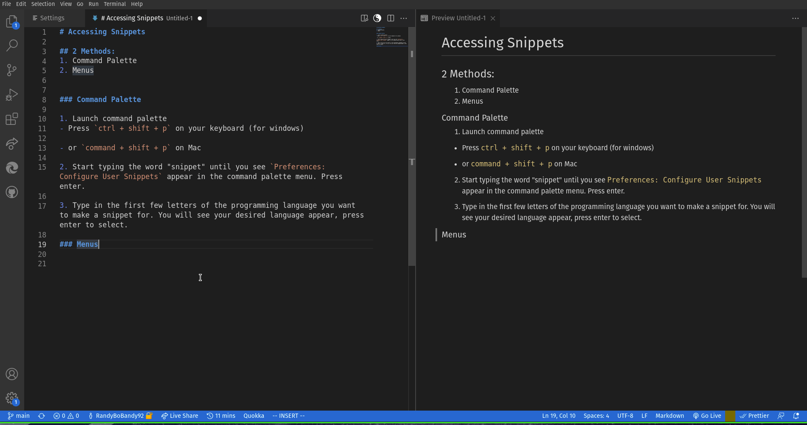
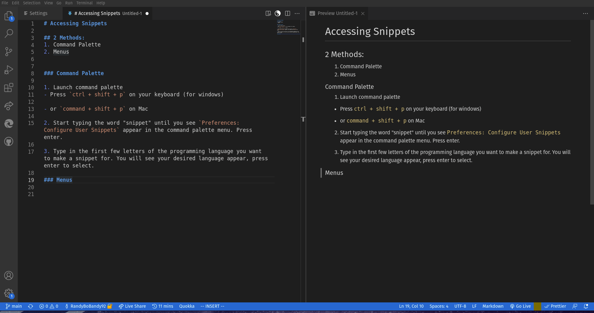

# Accessing Snippets

## 2 Methods:
1. Command Palette
2. Menus

### Command Palette

1. Launch command palette
- Press `ctrl + shift + p` on your keyboard (for windows)

- or `command + shift + p` on Mac

2. Start typing the word "snippet" until you see `Preferences: Configure User Snippets` appear in the command palette menu. Press enter.

3. Type in the first few letters of the programming language you want to make a snippet for. You will see your desired language appear, press enter to select.

### Menus

1. Go to `File > Preferences > User Snippets`

2. Type in the first few letters of the programming language you want to make a snippet for. You will see your desired language appear, press enter to select.

