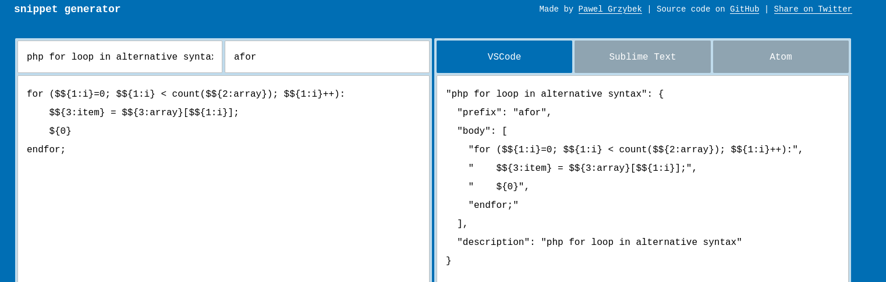
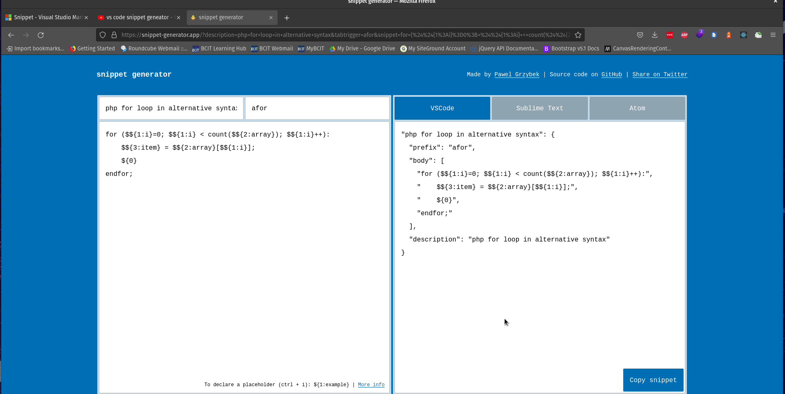

# Creating Snippets

## Resources
- https://snippet-generator.app/

Snippet Generator handles writing all the json data for us, so we can write our code (nearly) like normal, then paste it in to the snippet generator.


## Example

As an example, let's say we want to make a php snippet that does a for loop in the alternative syntax (with `for` and `endfor`).

```php
// Example
$things = array(1,2,3)

for ($i=0; $i < count($things); $i++) :
    $thing = $things[i];
endfor;
```

There are 3 places where we will want to have tab stops:
1. to rename `$i`
1. to rename `$things`
1. to rename `$thing`

We will also need to create the final cursor position.

Let's turn this into code a snippet generator can use.

```php
// Snippet Example

// ${1} - Renamable index variable
// ${2} - Renamable array variable
// ${3} - Renamable item variable
// ${0} - Final Cursor Position

for ($${1:i}=0; $${1:i} < count($${2:array}); $${1:i}++):
    $${3:item} = $${2:array}[$${1:i}];
    ${0}
endfor;
```

Now we can convert this into a VS Code snippet



Copy that snippet text, and paste it inside your php VS Code snippet file.

