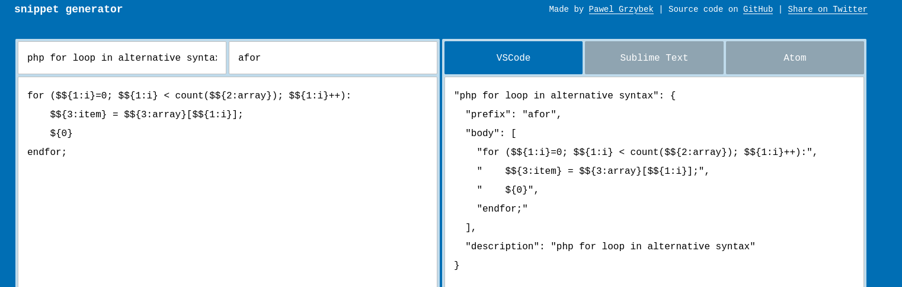
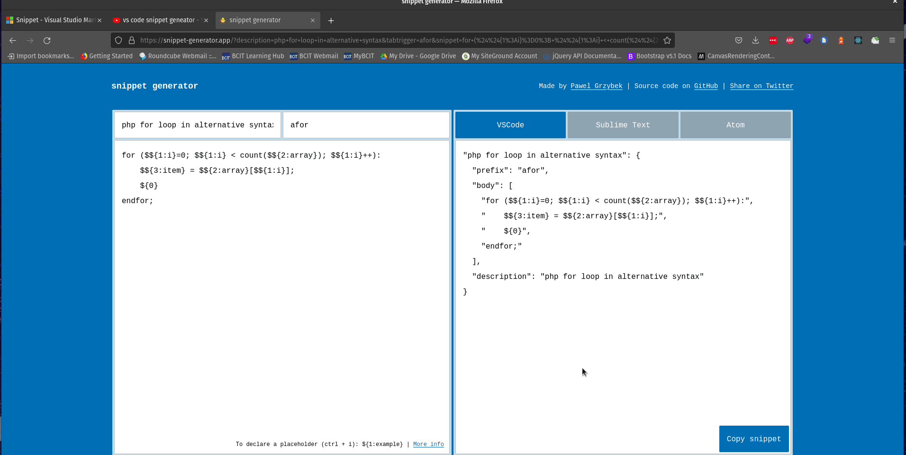

# Creating Snippets

## Resources
- https://snippet-generator.app/

Snippet Generator handles writing all the json data for us, so we can write our code (nearly) like normal, then paste it in to the snippet generator.


## Example 1 - PHP Tags

Say we want to write snippets that allow us to quickly create `<?php ?>` tags

```php
// Example

// block style    
<?php

?>

// line style
<?php  ; ?> 
```

All we have to do to make these ready for use in the snippet generator, is add a final cursor position to each.


```php
// Example w/ final cursor positions added

// block style    
<?php
    $0
?>

// line style
<?php $0 ; ?> 
```

**NOTE:** because we will be inside html when we are using these snippets, we have to add them to our HTML snippet file. All other examples we will be putting snippets into the PHP snippet file.

## Example 2 - PHP if and while

Here we will be adding one tab stop to each of the snippets.

```php
if (${1:condition}):
   $0 ;
endif;

while (${1:condition}):
   $0 ;
endwhile;
```

## Example 3 - WordPress Query

Looking up or copying a WP query from other projects can be time consuming, it would be nice to just have all the things we use on a regular basis available as a snippet.

https://developer.wordpress.org/reference/classes/wp_query/#div-comment-5502

I found another developer has already done the hard work of making a template for us to use!

```php

$args = array(
    'post_type'              => array('post'), // use any for any kind of post type, custom post type slug for custom post type
    'post_status'            => array('publish'), // Also support: pending, draft, auto-draft, future, private, inherit, trash, any
    'posts_per_page'         => '5', // use -1 for all post
    'order'                  => 'DESC', // Also support: ASC
    'orderby'                => 'date', // Also support: none, rand, id, title, slug, modified, parent, menu_order, comment_count
    'tax_query'              => array(
        'relation' => 'OR', // Use AND for taking result on both condition true
        array(
            'taxonomy'         => 'category', // taxonomy slug
            'terms'            => array(1, 2), // term ids
            'field'            => 'term_id', // Also support: slug, name, term_taxonomy_id
            'operator'         => 'IN', // Also support: AND, NOT IN, EXISTS, NOT EXISTS
            'include_children' => true,
        ),
        array(
            'taxonomy'         => 'custom-category', // taxonomy slug
            'terms'            => array(1, 2), // term ids
            'field'            => 'term_id', // Also support: slug, name, term_taxonomy_id
            'operator'         => 'IN', // Also support: slug, name, term_taxonomy_id
            'include_children' => true,
        ),
    ),
);
$query = new WP_Query( $args );
?>
 
<?php if ( $query->have_posts() ) : ?>
 
    <!-- pagination here -->
 
    <!-- the loop -->
    <?php while ( $query->have_posts() ) : $query->the_post(); ?>
        <h2><?php the_title(); ?></h2>
    <?php endwhile; ?>
    <!-- end of the loop -->
 
    <!-- pagination here -->
 
    <?php wp_reset_postdata(); ?>
 
<?php else : ?>
    <p><?php _e( 'Sorry, no posts matched your criteria.' ); ?></p>
<?php endif; ?>
```

No need to add any other symbols, since you would likely go through the items you need to change manually

## Snippet generation & adding to VS Code
Now we are ready to generate our snippets. We'll have to repeat these steps for each of our snippets to add. 



Copy that snippet text, and paste it inside your php VS Code snippet file.



There ya go that's snippets ✌️