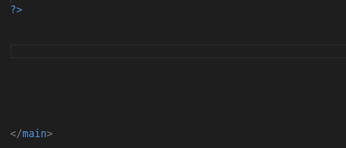
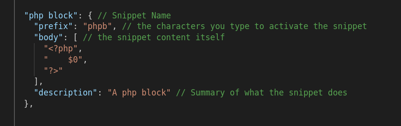
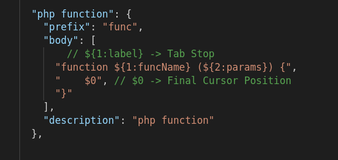

# What are Snippets?

Snippets allow you to quickly create repetitive boilerplate code.



Snippets are stored inside VS Code snippet files, which are in JSON format

### Example Snippet File

```json
"php for loop in alternative syntax": {
  "prefix": "afor",
  "body": [
    "for ($${1:i}=0; $${1:i} < count($${2:array}); $${1:i}++):",
    "    $${3:item} = $${2:array}[$${1:i}];",
    "    ${0}",
    "endfor;"
  ],
  "description": "php for loop in alternative syntax"
}
```

## Snippets Defined



## Snippet Symbols

When you are making a snippet, there are 2 main types of symbols:
1. Tab Stops
2. Final Cursor Position



## Tab Stops

Tab Stops let us rename portions of our code

```php
function funcName ($params) {
    
}


// Written with tab stops

function ${1:funcName} ($${2:params}) {
    ${0}
}

```

## Final Cursor Position

Final Cursor Position allows you to specify where you want your.. final cursor position to be! (**wow**)