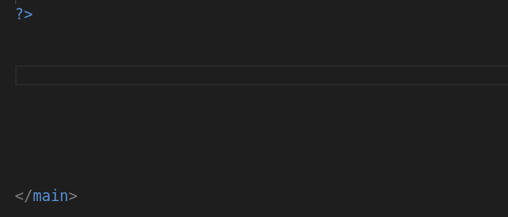
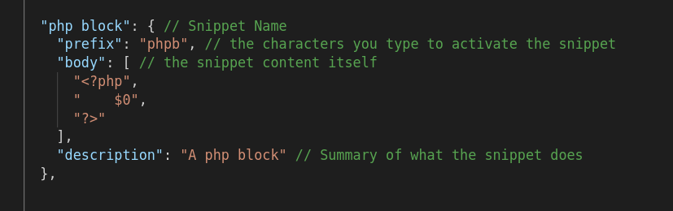
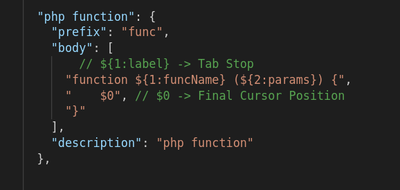

# What are Snippets?

Snippets allow you to quickly create repetitive boilerplate code.

When you use `!` in a html file to quickly make boilerplate, you are using snippets. Same with `rcfe` in react.



Snippets are stored inside VS Code snippet files, which are in JSON format

## Why use Snippets?
- The less that we have to type ourselves, the less likelihood of missing semicolons, typos, etc.
- Less time looking up syntax, more productivity

## Snippets Defined



## Snippet Symbols

When you are making a snippet, there are 2 main types of symbols:
1. Tab Stops
2. Final Cursor Position



## Tab Stops

Tab Stops let us rename portions of our code

```php
function funcName ($params) {
    
}


// Written with tab stops

function ${1:funcName} ($${2:params}) {
    ${0}
}

```

## Final Cursor Position

Final Cursor Position allows you to specify where you want your.. final cursor position to be! (**wow**)